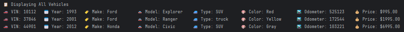

# 🚗🛻🚙 Vehicle Dealership Management System

Welcome to the **Vehicle Dealership Management System**! This project allows the user to manage a vehicle inventory for a dealership. It provides a command-line interface (CLI) for performing various operations on the list of vehicles, such as filtering vehicles based on attributes, adding new vehicles, or removing existing ones.


---

## ✨ Features

- 💰 **Filter by Price**
  - Allows the user to filter vehicles within a specific price range.

- 🏷️ **Filter by Make and Model**
  - Enables the user to filter vehicles by their make and model.

- 📅 **Filter by Year**
  - Lets the user search for vehicles within a specified year range.

- 🎨 **Filter by Color**
  - Enables the user to filter vehicles by their color.

- 🛣️ **Filter by Mileage**
  - Lets the user filter vehicles based on their mileage.

- 🚘 **Filter by Vehicle Type**
  - Provides an option to filter vehicles by their type (e.g., Car, Truck, SUV, Van).

- 📋 **Display All Vehicles**
  - Displays all vehicles currently available in the dealership's inventory.

- ➕ **Add a Vehicle**
  - Lets the user add a new vehicle to the inventory.

- ➖**Remove a Vehicle**
  - Allows the user to remove a vehicle from the dealership's inventory.

### Filtering Screenshots

Price Filtering


Make & Model Filtering


Year Filtering


Color Filtering


Mileage Filtering


Vehicle Type Filtering


Display All Vehicles



Adding Vehicle


Removing Vehicle


---

## 🗂️ File List

| **File Name**                | **Purpose**                                                                       | **Key Features**                                                                                                                                                                               |
|------------------------------|-----------------------------------------------------------------------------------|------------------------------------------------------------------------------------------------------------------------------------------------------------------------------------------------|
| `UserInterface.java`         | Handles the main user interface for the dealership system.                        | - Displays menu with options to filter by price, make/model, year, color, mileage, vehicle type.<br>- Allows users to add or remove vehicles.<br>- Handles input validation for user commands. |
| `Dealership.java`            | Represents the dealership and its inventory of vehicles.                          | - Stores a list of `Vehicle` objects.<br>- Provides methods for filtering vehicles by attributes.<br>- Methods for adding, removing, and retrieving vehicles.                                  |
| `Vehicle.java`               | Represents a single vehicle in the dealership's inventory.                        | - Stores vehicle details (VIN, year, make, model, etc.).<br>- Contains a `toString` method to display vehicle details.                                                                         |
| `DealershipFileManager.java` | Manages loading and saving the dealership's vehicle inventory from/to a CSV file. | - Loads vehicles from a CSV file.<br>- Saves inventory to CSV after updates.<br>- Ensures data persistence.                                                                                    |
| `exceptions.log`             | A log file to track any errors or exceptions that occur during program execution. | - Timestamps errors.<br>- Logs exception messages to help diagnose issues.                                                                                                                     |

---

## 📜 Error Logging 

Whenever an error occurs (such as invalid user input or unexpected system failures), the program logs the error details to a file called `exceptions.log`. This log includes:

- **Timestamp**: The date and time when the error occurred.
- **Error Message**: The exception message detailing what went wrong.

This log can help developers diagnose and troubleshoot issues with the program.

### Example of Logged Error:
Time of occurrence: 2025-05-11 14:30:12 Invalid input: -1 for mileage


---

# 🔥 Cool Code Highlight: Dynamic Vehicle Filtering

The `processGetByMakeModelRequest()` method demonstrates a smart and user-friendly way to filter vehicles based on flexible input (make, model, or both):

````
System.out.print("👉 Enter Make: ");
String make = scanner.nextLine();
System.out.print("👉 Enter Model: ");
String model = scanner.nextLine();

ArrayList<Vehicle> filteredVehicles = dealership.getVehiclesByMakeModel(make, model);

if(make.isEmpty() && model.isEmpty()) {
    System.out.println("❌ Oops! You left both the make and model blank. 🛠️ Please enter at least one to filter vehicles.");
}
else if (!make.isEmpty() && model.isEmpty()) {
    System.out.println("\n🔍 Displaying Filtered Make Range");
    ...
}
else if (make.isEmpty() && !model.isEmpty()) {
    System.out.println("\n🔍 Displaying Filtered Model Range");
    ...
}
else {
    System.out.println("\n🔍 Displaying Filtered Make & Model Range");
}

````
---

## ⚠️ Disclaimer

This project is intended for **educational purposes only**. While it simulates a vehicle dealership management system, it is not designed for real-world commercial use.

The data handling (e.g., saving to CSV, logging errors) is simplified for clarity and learning, and does not implement production-level data validation, security, or error recovery.

Use this code at your own risk. The developers are not responsible for any data loss, system issues, or unintended consequences resulting from the use or modification of this software.

> 💡 Always test thoroughly and handle sensitive data responsibly in real-world applications.

---

# 🧑‍💻 Author
💻 Developed by: Meixin Zhang

📅 Date: May 11th, 2025

Created with ❤️ using Java.
